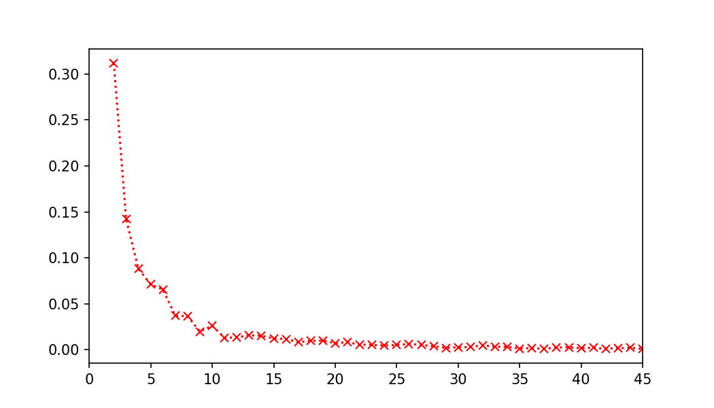

# 体系结构实验1

<center>梁鑫嵘 200110619</center>

## 编写 insDependDist 插桩工具

### Instruction 函数

本函数完成了每次执行新指令之前的动作，包括查找所有被读取和被写入的寄存器，然后交给 `updateInsDependDistance` 函数进行处理。

```C
// Pin calls this function every time a new instruction is encountered
// 每次遇到新指令时 Pin 都会调用此函数
VOID Instruction(INS ins, VOID *v) {
  // regs stores the registers read, written by this instruction
  // regs 存储由该指令读取、写入的寄存器
  Registers *regs = new Registers();

  // Find all the register written
  // 查找所有写入的寄存器
  for (uint32_t iw = 0; iw < INS_MaxNumWRegs(ins); iw++) {
    // 获取当前指令中被写的寄存器(即目的寄存器)
    REG wr = INS_RegW(ins, iw);
    // 获取寄存器名
    wr = REG_FullRegName(wr);
    if (!REG_valid(wr)) continue;

    // 将被写寄存器保存到regs->write当中
    if (std::find(regs->write.begin(), regs->write.end(), wr) ==
        regs->write.end())
      regs->write.push_back(wr);
  }

  // Find all the registers read
  // 查找所有读取的寄存器
  for (uint32_t ir = 0; ir < INS_MaxNumRRegs(ins); ir++) {
    // 获取当前指令中被写的寄存器(即目的寄存器)
    REG rr = INS_RegR(ins, ir);
    // 获取寄存器名
    rr = REG_FullRegName(rr);
    if (!REG_valid(rr)) continue;
    // 将被读寄存器保存到regs->read当中
    if (std::find(regs->read.begin(), regs->read.end(), rr) == regs->read.end())
      regs->read.push_back(rr);
  }

  // Insert a call to the analysis function -- updateInsDependDistance -- before
  // every instruction. Pass the regs structure to the analysis function.
  INS_InsertCall(ins, IPOINT_BEFORE, (AFUNPTR)updateInsDependDistance, IARG_PTR,
                 (void *)regs, IARG_END);
}
```

### updateInsDependDistance 函数

本函数需完成以下2个任务：

1. (A) 遍历`regs->read`向量，利用`lastInsPointer`数组计算当前指令的被读寄存器的依赖距离，即对任意的`r`属于`regs->read`, 其`依赖距离 = 当前PC值 - lastInsPointer[r]`.
2. (B) 遍历`regs->write`向量，利用`lastInsPointer`数组记录当前指令的被写寄存器所对应的PC值， 即对任意的`r`属于`regs->write`,将当前PC值赋值给`lastInsPointer[r]`.

那么A和B哪个应该先执行呢？应当先执行 A。

举一个简单的例子说明：

```
MOV A, B
ADD A, A, A
```

假设有如上两条指令，如果先执行 B，在解析 `ADD A,A,A` 这条指令时，`lastInsPointer[A]` 被首先更新为当前 PC，然后再执行 A，就会得到当前指令的寄存器 `A` 依赖距离为 0，但是寄存器 `A` 的数据应当来自上一条指令而不是这一条指令，所以应当先执行 A。

```C
VOID updateInsDependDistance(VOID *v) {
  ++insPointer;
  Registers *regs = (Registers *)v;
  for (vector<reg_t>::iterator it = regs->read.begin(); it != regs->read.end();
       it++) {
    // 当前读寄存器
    reg_t reg = *it;

    if (lastInsPointer[reg] > 0) {
      // 有访问过这个寄存器
      // 当前指令号 - 上次访问指令号 = 寄存器依赖距离
      INT32 distance = insPointer - lastInsPointer[reg];
      // 统计当前依赖距离出现次数
      if (distance <= maxSize) insDependDistance[distance]++;
    }
  }
  // 更新写入寄存器的 lastInstructionCount
  for (vector<reg_t>::iterator it = regs->write.begin();
       it != regs->write.end(); it++)
    lastInsPointer[*it] = insPointer;
}
```

### 运行一些命令得到的结果

在本人的笔记本上运行的结果如下。笔记本电脑的 CPU 参数：


```Bash
$ make pin-run COMMAND="cat Makefile"
```


```Bash
$ make pin-run COMMAND=clear
```


```Bash
$ make pin-run COMMAND=ls
```



```Bash
$ make pin-run COMMAND=pwd
```


将上面几张图片叠加起来：

```Bash
$ make pin-run-commands
```


可以发现多数命令依赖距离曲线在 10 附近有一个小幅度的凸起。

在实验室的台式机上运行并叠加图片：

```Bash
$ make pin-run-commands
```


这次的凸起位置和大小不同，可能是由于实际运行的操作系统和二进制文件不同造成的差异。

## 附加题

要求参考 `inscount2.cpp`，将 `insDependDist` 修改为基于轨迹级的较粗粒度的插桩分析。

### 实现思路

为了充分发挥 CPU 顺序执行的特点，防止 CPU 每次执行一条指令就要跳转到 Pin 工具这边计算数据，我们可以将 CPU 的指令执行流划分为跳转与跳转之间的基本块（basic block, BBL），然后每次统计每个基本块内所有指令的数据。

### 关键实现代码

由于在编译过程中出现了找不到一些 `.so` 文件的问题，这里将 `$(PIN_TOOL)/source/tools/ManualExamples` 下的所有 `*.cpp, *.c` 复制到 `workspace` 下以解决这个问题。这里将基于轨迹的插桩分析命名为 `insDependDist2`。

与 `insDependDist` 一样，我们首先在一个函数中为另一个实际统计指令数据的函数做数据准备。这里的函数叫 `Trace`。在 `main` 中注册这个轨迹级监听函数：

```C
  // Register Instruction to be called to instrument instructions
  TRACE_AddInstrumentFunction(Trace, 0);
```

在 `Trace` 函数内，遍历每一个 BBL，然后对每一个 BBL 遍历指令，将指令储存在一个列表中交给下一个函数 `updateInsDependDistance`。

```C
VOID Trace(TRACE trace, VOID* v) {
  // Visit every basic block in the trace
  for (BBL bbl = TRACE_BblHead(trace); BBL_Valid(bbl); bbl = BBL_Next(bbl)) {
    vector<Registers*>* insts = new vector<Registers*>();
    for (INS ins = BBL_InsHead(bbl); INS_Valid(ins); ins = INS_Next(ins)) {
      // regs 存储由该指令读取、写入的寄存器
      Registers* regs = new Registers();
      // 查找所有写入的寄存器
      for (uint32_t iw = 0; iw < INS_MaxNumWRegs(ins); iw++) {
        // 获取当前指令中被写的寄存器(即目的寄存器)
        REG wr = INS_RegW(ins, iw);
        // 获取寄存器名
        wr = REG_FullRegName(wr);
        if (!REG_valid(wr)) continue;

        // 将被写寄存器保存到regs->write当中
        if (std::find(regs->write.begin(), regs->write.end(), wr) ==
            regs->write.end())
          regs->write.push_back(wr);
      }
      // 查找所有读取的寄存器
      for (uint32_t ir = 0; ir < INS_MaxNumRRegs(ins); ir++) {
        // 获取当前指令中被写的寄存器(即目的寄存器)
        REG rr = INS_RegR(ins, ir);
        // 获取寄存器名
        rr = REG_FullRegName(rr);
        if (!REG_valid(rr)) continue;
        // 将被读寄存器保存到regs->read当中
        if (std::find(regs->read.begin(), regs->read.end(), rr) ==
            regs->read.end())
          regs->read.push_back(rr);
      }
      insts->push_back(regs);
    }
    BBL_InsertCall(bbl, IPOINT_BEFORE, AFUNPTR(updateInsDependDistance), 
                   IARG_PTR, insts, IARG_END);
  }
}
```

在函数 `updateInsDependDistance` 中，批量分析单个 BBL 内的所有指令。

```C
VOID PIN_FAST_ANALYSIS_CALL updateInsDependDistance(void* insts_ptr) {
  vector<Registers*>* insts = (vector<Registers*>*)(insts_ptr);
  for (auto regs : *insts) {
    ++insPointer;
    for (vector<reg_t>::iterator it = regs->read.begin();
         it != regs->read.end(); it++) {
      // 当前读寄存器
      reg_t reg = *it;
      if (lastInsPointer[reg] > 0) {
        // 有访问过这个寄存器
        // 当前指令号 - 上次访问指令号 = 寄存器依赖距离
        INT32 distance = insPointer - lastInsPointer[reg];
        // 统计当前依赖距离出现次数
        if (distance <= maxSize) insDependDistance[distance]++;
      }
    }

    // 更新写入寄存器的 lastInstructionCount
    for (vector<reg_t>::iterator it = regs->write.begin();
         it != regs->write.end(); it++)
      lastInsPointer[*it] = insPointer;
  }
}
```

### 测试方法

因为指令级的插桩对性能影响比较大，这里采用微处理器常用的跑分程序 CoreMark 进行性能测试。

修改前的结果：

```Bash
$ make perf MY_PIN_TOOL=insDependDist
/opt/pin/pin-3.24-98612-g6bd5931f2-gcc-linux/pin -t obj-intel64/insDependDist.so --  ./coremark.exe
2K performance run parameters for coremark.
CoreMark Size    : 666
Total ticks      : 7146
Total time (secs): 7.146000
Iterations/Sec   : 419.815281
ERROR! Must execute for at least 10 secs for a valid result!
Iterations       : 3000
Compiler version : GCC12.2.0
Compiler flags   : -O2   -lrt
Memory location  : Please put data memory location here
                        (e.g. code in flash, data on heap etc)
seedcrc          : 0xe9f5
[0]crclist       : 0xe714
[0]crcmatrix     : 0x1fd7
[0]crcstate      : 0x8e3a
[0]crcfinal      : 0xcc42
Errors detected
```


修改后的结果：

```Bash
$ make perf MY_PIN_TOOL=insDependDist2
/opt/pin/pin-3.24-98612-g6bd5931f2-gcc-linux/pin -t obj-intel64/insDependDist2.so --  ./coremark.exe
2K performance run parameters for coremark.
CoreMark Size    : 666
Total ticks      : 4736
Total time (secs): 4.736000
Iterations/Sec   : 633.445946
ERROR! Must execute for at least 10 secs for a valid result!
Iterations       : 3000
Compiler version : GCC12.2.0
Compiler flags   : -O2   -lrt
Memory location  : Please put data memory location here
                        (e.g. code in flash, data on heap etc)
seedcrc          : 0xe9f5
[0]crclist       : 0xe714
[0]crcmatrix     : 0x1fd7
[0]crcstate      : 0x8e3a
[0]crcfinal      : 0xcc42
Errors detected
```


相比于直接运行：

```Bash
$ ./coremark.exe 
2K performance run parameters for coremark.
CoreMark Size    : 666
Total ticks      : 157
Total time (secs): 0.157000
Iterations/Sec   : 19108.280255
ERROR! Must execute for at least 10 secs for a valid result!
Iterations       : 3000
Compiler version : GCC12.2.0
Compiler flags   : -O2   -lrt
Memory location  : Please put data memory location here
                        (e.g. code in flash, data on heap etc)
seedcrc          : 0xe9f5
[0]crclist       : 0xe714
[0]crcmatrix     : 0x1fd7
[0]crcstate      : 0x8e3a
[0]crcfinal      : 0xcc42
Errors detected
```

不控制 CoreMark 的 `ITERARIONS` 参数，让它直接运行并跑满 10s：

```Bash
$ ./coremark.exe
2K performance run parameters for coremark.
CoreMark Size    : 666
Total ticks      : 15457
Total time (secs): 15.457000
Iterations/Sec   : 19408.682150
Iterations       : 300000
Compiler version : GCC12.2.0
Compiler flags   : -O2   -lrt
Memory location  : Please put data memory location here
                        (e.g. code in flash, data on heap etc)
seedcrc          : 0xe9f5
[0]crclist       : 0xe714
[0]crcmatrix     : 0x1fd7
[0]crcstate      : 0x8e3a
[0]crcfinal      : 0xcc42
Correct operation validated. See README.md for run and reporting rules.
CoreMark 1.0 : 19408.682150 / GCC12.2.0 -O2   -lrt / Heap
```

得到的 `Iterations/Sec` 差不多，所以当 `ITERATION=3000` 时，数据是有参考价值的。

### 测试结果

从图上可以看出，因为运行的是同一个相同参数的二进制文件，测得寄存器距离是相同的。

而由运行数据可知，修改后的基于轨迹的插桩，在 CoreMark 这一 Workload 下性能相比基于指令的插桩高出了约 50.89%，基于轨迹的较粗粒度的插桩效率比基于指令的较细粒度的插桩性能好上不少。
