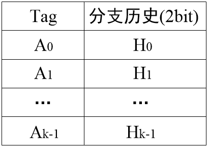
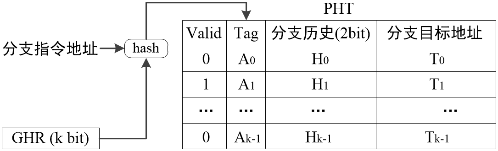
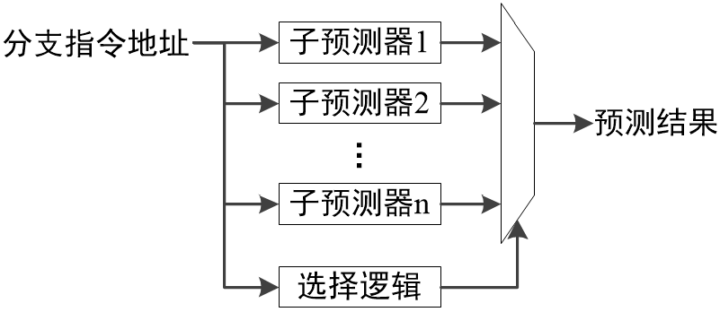
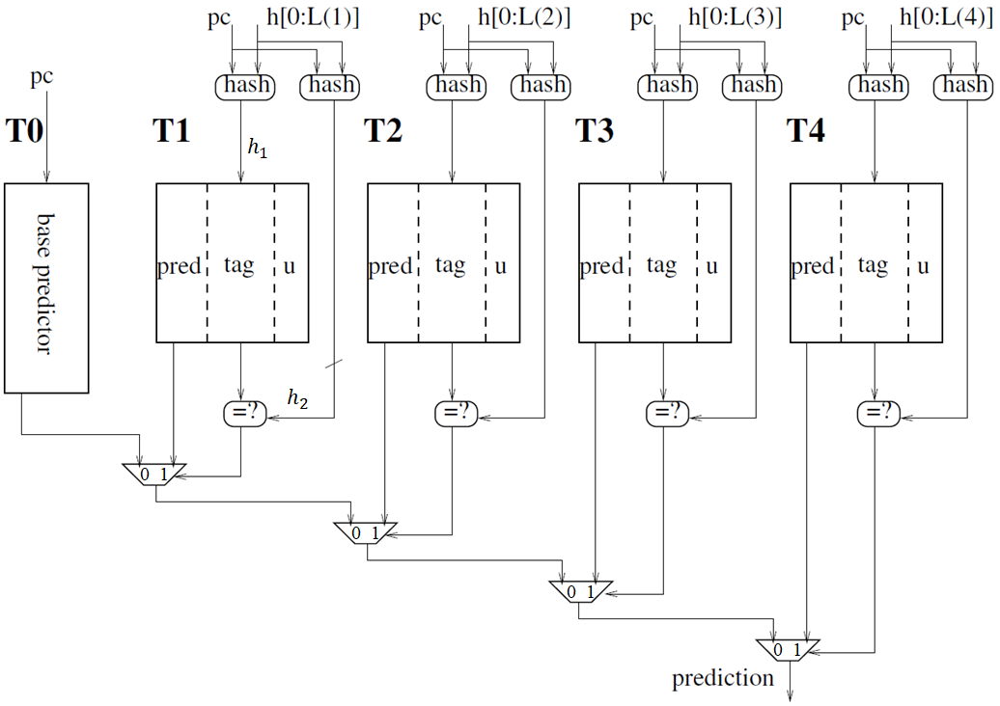
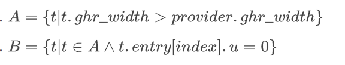

# 体系结构实验2

## 题目分析

本实验要求实现多个分支预测器的软件模型并使用 Pin 工具分析这些模型在实际情况下的表现。

### 基于 BHT 的分支预测

BHT 预测器结构简单，易于实现，使用资源少，而且实际表现也不错，对大多数的 workload 其预测准确率都在 $90\%$ 以上。BHT 直接取地址中的部分位作为 Branch History Table 的索引，取出一个 2 bit 饱和计数器并将其预测结果作为整个预测器的结果输出。BHT 使用时钟周期一般为 1。



类似于 Cache 的直接映射缓存，BHT 直接取地址的位作为表的索引，这种做法可能会因 Tag 冲突造成一个饱和计数器对应于多个地址的跳转，从而使得饱和计数器可能抖动降低 BHT 预测器整体的表现。

同时，BHT 忽视了分支指令之间的关联性，仅关注指令地址，从而降低了其描述性。

### 基于全局历史的分支预测

为了关注分支指令之间的关联性，基于全局历史的分支预测在 BHT 基础上添加了 GHR 全局历史寄存器来将所有的分支指令关联起来。



通过添加 GHR，实现了将相同地址、不同轨迹的跳转情况对应到不同的饱和计数器，提高了模型的描述性和性能。

### 锦标赛分支预测器

锦标赛分支预测（又称混合分支预测或组合分支预测）是一种博采众长的分支预测方法，其基本原理是将两个或以上的分支预测方法进行结合，充分发挥各预测方法的优势，以进一步提高分支预测的准确度。



其基本逻辑是通过饱和计数器控制该选择哪一个子预测器的预测结果，不断选择正确率较高的那一个。

### TAGE 分支预测器

TAGE 分支预测器通过比较复杂的结构和逻辑完成了对以上几种结构的综合和超越。



其基本思想有：

1. 吸收 BHT 分支预测结构经验，将饱和计数器作为最小的预测单元
2. 类似锦标赛分支预测器，每次分支预测都选择一个子分支预测器的结果，并通过 `usefulness` 不断调整子分支预测器之间的优先级
3. 类似全局历史分支预测器，将待预测的地址首先进行一次哈希操作再去查表，考虑全局的情况
4. 添加了 Tag 字段，判断第二次哈希后是否 Tag 匹配，减少了不同地址使用到同一个 `entry` 的碰撞情况
5. 使用定时复位权值的方法，防止一直使用某个子预测器的预测值

## 设计与实现

### 方案设计

#### BHT 预测器设计

首先建立 BHT 表项结构。

```c++
class BHTEntry {
public:
  bool valid = false;
  SaturatingCnt cnt;
  ADDRINT target = 0;
  ADDRINT tag = 0;
  explicit BHTEntry(size_t width = 2) : cnt(SaturatingCnt(width)) {}
}
```

定义将地址转换为 Tag 和取 BHTEntry 的函数，这里转换直接取地址中从第三位开始的低位。

```c++
  uint64_t getTagFromAddr(ADDRINT addr) override {
    return truncate(addr >> 2, m_entries_log);
  }

  virtual BHTEntry &getEntryFromAddr(ADDRINT addr) {
    return entries[getTagFromAddr(addr)];
  }
```

预测逻辑：取 `entries[tag]` 这一饱和预测器的预测结果。如果指定了需要预测地址，就返回预测的地址。

```c++
  ADDRINT predict(ADDRINT addr) override {
    // Produce prediction according to BHT
    auto entry = getEntryFromAddr(addr);
    if (predict_address) {
      return entry.cnt.isTaken() ? (entry.target ? entry.target : 1) : 0;
    } else {
      return entry.cnt.isTaken() ? 1 : 0;
    }
  }
```

更新逻辑：更新 `entries[tag]` 这一饱和预测器。

```c++
void update(BOOL takenActually, BOOL takenPredicted, ADDRINT addr, ADDRINT target) override {
    // Update BHT according to branch results and prediction
    auto &entry = getEntryFromAddr(addr);
    if (takenActually) {
        entry.cnt.increase();
        entry.target = target;
    } else {
        entry.cnt.decrease();
    }
  }
```

#### 全局历史预测器设计

```c++
template<UINT128 (*hash)(UINT128 addr, UINT128 history)>
class GlobalHistoryPredictor : public BHTPredictor {
    ShiftReg *m_ghr;                   // GHR
    // ...
```

这里直接继承了 `BHTPredictor`，复用更多代码；添加了全局历史寄存器 `m_ghr`。

重写了从地址中取 Tag 的函数：

```c++
  uint64_t getTagFromAddr(ADDRINT addr) override {
    return truncate(hash(addr, m_ghr->getVal()), m_entries_log);
  }
```

哈希函数作为 C++ 模板参数被传入，定义哈希函数的静态类如下，添加了 `fold` 等哈希算法。

```c++
class HashMethods {
private:
  /**
   * Fold data h into m bytes
   */
  template<typename F>
  static UINT128 fold(UINT128 h, UINT128 m, F const &f) {
    UINT128 r = 0;
    for (int i = 0; i < (128 / 8) / m; i++) {
      auto s = ((1 << (8 * m)) - 1) & h;
      h >>= (8 * m);
      r = f(r, s);
    }
    return r;
  }

public:
  /**
   * Simply slice address to make hash, assert 4 bytes align
   * @return hashed data
   */
  inline static UINT128 slice(UINT128 addr, UINT128 history) {
    return addr >> 2;
  }

  inline static UINT128 hash_xor(UINT128 addr, UINT128 history) {
    return (addr >> 2) ^ history;
  }

  inline static UINT128 fold_xor(UINT128 addr, UINT128 history) {
    return fold(addr, 2, [](auto a, auto b) { return a ^ b; }) ^ history;
  }

  // Hash functions
  inline static UINT128 f_xor(UINT128 a, UINT128 b) { return a ^ b; }

  inline static UINT128 f_xor1(UINT128 a, UINT128 b) { return ~a ^ ~b; }

  inline static UINT128 f_xnor(UINT128 a, UINT128 b) { return ~(a ^ ~b); }
};
```


预测逻辑与 `BHTPredictor` 一致，更新逻辑上添加了 GHR 寄存器更新过程。

```c++
  void update(bool takenActually, bool takenPredicted, ADDRINT addr, ADDRINT target) override {
    // Update GHR and PHT according to branch results and prediction
    auto &entry = getEntryFromAddr(addr);
    if (takenActually) {
      entry.cnt.increase();
      entry.target = target;
    } else {
      entry.cnt.decrease();
    }
    m_ghr->shiftIn(takenActually);
  }
```

#### 锦标赛预测器设计

预测逻辑：根据饱和计数器的结果选择预测器结果。

```c++
  ADDRINT predict(ADDRINT addr) override {
    if (m_gshr->isTaken()) {
      return m_BPs[1]->predict(addr);
    } else {
      return m_BPs[0]->predict(addr);
    }
  }
```

更新逻辑：根据子预测器预测是否正确，更新饱和计数器，然后再更新子预测器。

```c++
  void update(bool takenActually, bool takenPredicted, ADDRINT addr, ADDRINT target) override {
    auto predict1 = m_BPs[0]->predict(addr);
    auto predict2 = m_BPs[1]->predict(addr);
    bool correct1, correct2;
    if (!predict_addr) {
      auto actually = takenActually ? 1 : 0;
      correct1 = (predict1 ? 1 : 0) == actually;
      correct2 = (predict2 ? 1 : 0) == actually;
    } else {
      correct1 = predict1 == target;
      correct2 = predict2 == target;
    }
    if (correct1 != correct2) {
      if (correct1) {
        m_gshr->decrease();
      } else {
        m_gshr->increase();
      }
    }
    m_BPs[0]->update(takenActually, takenPredicted, addr, target);
    m_BPs[1]->update(takenActually, takenPredicted, addr, target);
  }

```

##### TAGE 预测器设计

先定义 `useful` 字段的更新逻辑：

```c++
  void update_useful_entry(int predicator, int index, bool increase) {
    auto &usefulness = m_useful[predicator][index];
    if (increase) {
      if (usefulness != ((1 << useful_bits) - 1)) usefulness++;
    } else {
      if (usefulness != 0) usefulness--;
    }
  }
```

其更新逻辑类似饱和计数器，当达到极限之后不会继续向前。

##### TAGE 预测逻辑

首先找到所有 Tag 匹配的子预测器，同时找到这些预测器中 GHR 位宽最宽和次宽的。

```c++
    UINT128 predictors_max_ghr = 0;
    int predictors_max_ghr_index = -1;
    int predictors_max_ghr_index2 = -1;
    int tag_matched_count = 0;
    for (size_t i = 0; i < m_tnum; i++) {
      if (i != 0) {
        auto ghp = ((GlobalHistoryPredictor<hash1> *) (m_T[i]));
        auto entry = ghp->getEntryFromAddr(addr);
        auto h2 = hash2(addr, ghp->get_ghr_instance()->getVal());
        // Has tag matched
        if (entry.tag == h2) {
          tag_matched_count++;
          if (predictors_max_ghr < ghp->get_ghr_instance()->getMWid()) {
            predictors_max_ghr_index2 = predictors_max_ghr_index;
            predictors_max_ghr_index = (int) i - 1;
          }
        }
      }
    }
```

判断当前发生 Tag 匹配的子预测器数量，来确定 `provider` 和 `altpred`。

```c++
    altpred_index = 0;
    if (tag_matched_count == 0) {
      // use T0 as provider and altpred
      provider_index = 0;
    } else if (tag_matched_count == 1) {
      provider_index = predictors_max_ghr_index + 1;
    } else {
      // count >= 2
      provider_index = predictors_max_ghr_index + 1;
      altpred_index = predictors_max_ghr_index2 + 1;
    }
```

最后返回 `provider` 的预测结果。

```c++
    return m_T[provider_index]->predict(addr);
```

##### TAGE 更新逻辑

首先记录当前预测信息：

```c++
    auto predict_provider = m_T[provider_index]->predict(addr) != 0;
    auto predict_altpred = m_T[altpred_index]->predict(addr) != 0;
    auto provider_entry_index = m_T[provider_index]->getTagFromAddr(addr);
    auto branch_actually = (takenActually ? 1 : 0);
```

然后更新 `provider` 子预测器。

```c++
    // Update provider itself
    m_T[provider_index]->update(takenActually, takenPredicted, addr, target);
```

如果 `provider` 是 GHR 预测器而且 `provider` 和 `altpred` 预测结果不一样，更新 `useful` 字段。

```c++
    // Update usefulness
    if (provider_index != 0 && predict_altpred != predict_provider) {
      update_useful_entry(provider_index, provider_entry_index, predict_provider == branch_actually);
    }
```

当指令计数器达到指定的值，重置所有的 `useful` 字段。

```c++
    // Reset usefulness periodically
    m_rst_cnt++;
    if (m_rst_cnt == m_rst_period) {
      m_rst_cnt = 0;
      // T0 has no useful field
      for (int i = 1; i < m_tnum - 1; i++) {
        memset(m_useful[i], 0, sizeof(UINT8) * (1 << m_entries_log));
      }
    }
```

当 `provider` 预测失败时，分配 `entry`。

```c++
    // Entry replacement
    vector<int> predicator_a;
    vector<int> predicator_b;
    if (predict_provider != branch_actually) {
      // find a predictor that has longer history and usefulness==0
      for (int i = 1; i < m_tnum; i++) {
        if (i == provider_index) continue;
        auto ghp_provider = ((GlobalHistoryPredictor<hash1> *) (m_T[provider_index]));
        auto ghp = ((GlobalHistoryPredictor<hash1> *) (m_T[i]));
        bool longer_history;
        if (provider_index != 0) {
          longer_history = ghp->get_ghr_instance()->getMWid() > ghp_provider->get_ghr_instance()->getMWid();
        } else {
          longer_history = true;
        }
        if (longer_history) {
          predicator_a.emplace_back(i);
        }
        bool usefulness = m_useful[i][ghp->getTagFromAddr(addr)];
        if (usefulness == 0 && longer_history) {
          predicator_b.emplace_back(i);
        }
      }
    }
```

将子预测器填入两个分类 `A` 和 `B`：



1. 如果 $B\ne\emptyset$，在 $B$ 中找到 GHR 最小的子预测器进行更新：将对应 `entry` 的 `pred` 设置为 `weaktaken`，也就是重置饱和计数器
2. 如果 $B=\emptyset$，则将 $A$ 中所有子预测器的对应 `enrty` 的 `usefulness` 减一

代码中两个分类的 `index` 被存入 `predictor_a` 和 `predictor_b`，通过 `sort` 找到 GHR 最小的子预测器。

```c++
    sort(predicator_b.begin(), predicator_b.end(),
         [&](int &a, int &b) {
           auto c = (GlobalHistoryPredictor<hash1> *) m_T[a];
           auto d = (GlobalHistoryPredictor<hash1> *) m_T[b];
           return c->get_ghr_instance()->getMWid() > d->get_ghr_instance()->getMWid();
         });
```

然后判断 $B$ 是否非空，执行对应更新逻辑：

```c++
    if (!predicator_b.empty()) {
      auto i = *predicator_b.begin();
      auto p = (GlobalHistoryPredictor<hash1> *) m_T[i];
      p->reset_ctr(addr);
      memset(m_useful[i], 0, sizeof(UINT8) * (1 << m_entries_log));
      p->getEntryFromAddr(addr).tag = hash2(addr, p->get_ghr_instance()->getVal());
    } else {
      for (auto &i: predicator_a) {
        auto p = (GlobalHistoryPredictor<hash1> *) m_T[i];
        update_useful_entry(i, p->getTagFromAddr(addr), false);
        p->getEntryFromAddr(addr).tag = hash2(addr, p->get_ghr_instance()->getVal());
      }
    }
  }
```

### 试验结果以及分析

| 预测器         | `bzip2` | `sjeng` | `wrf`   | `sphinx3` |
| -------------- | ------- | ------- | ------- | --------- |
| BHT 预测器     | 92.9399 | 92.8024 | 92.9628 | 93.008    |
| 全局历史预测器 | 89.9521 | 89.802  | 90.2142 | 89.7957   |
| 锦标赛预测器   | 92.8214 | 92.6815 | 92.9097 | 92.8734   |
| TAGE 预测器    | 95.8063 | 95.7632 | 95.8886 | 95.8442   |

参数备注：（留空为默认参数）

| 预测器                                                | `bzip`     | `sjeng`    | `wrf`      | `sphinx3`  |
| ----------------------------------------------------- | ---------- | ---------- | ---------- | ---------- |
| BHT: `entry_log=11`、`scnt_width=2`                   |            |            |            |            |
| GH: `gw=8`, `e=11`, `sw=2`, `hash`                    | `fold_xor` | `fold_xor` | `fold_xor` | `hash_xor` |
| Tournament: `GH.hash`                                 | `fold_xor` | `fold_xor` | `fold_xor` | `fold_xor` |
| TAGE:`tn=3`, `T0_e=11`, `T1_gw=2`, `a=1.4`, `Tn_e=11` |            |            |            |            |
