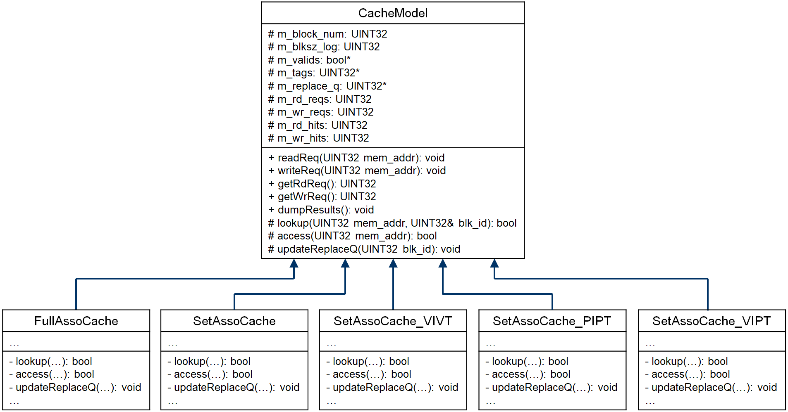
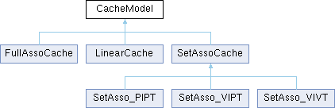

# 体系结构实验3

## 题目分析

本实验要求实现多个缓存的软件模型并使用 Pin 工具分析这些模型在实际情况下的表现。

具体内容包括：

1. 利用Pin插桩工具，编写全相联、组相联映射的Cache模型；
2. 探讨命中率与Cache基本参数（如块大小、块数/容量、相联度、替换算法等）的关系，自行选择若干组参数进行测试，绘制折线图并分析之；
3. 实现VIVT、PIPT、VIPT三种地址索引方式的组相联Cache，并通过测试，对比分析三种索引方式的区别和优缺点。

## 设计与实现

### 方案设计

相比于原方案设计，本设计修改了各个模块之间的继承和组合关系，使得代码更符合逻辑。

原 Cache 类图：

现在的继承关系：

`DirectMappingCache` 是 `LinearCache` 的别名；`FullAssoCache` 和 `SetAssoCache` 的子类通过将一个或多个 `LinearCache` 作为类成员储存 Cache 信息。

同时完成了替换算法接口以及实现：

### 试验结果以及分析
