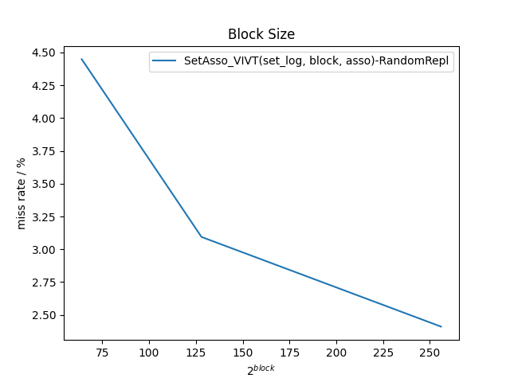

# 体系结构实验3

## 题目分析

本实验要求实现多个缓存的软件模型并使用 Pin 工具分析这些模型在实际情况下的表现。

具体内容包括：

1. 利用Pin插桩工具，编写全相联、组相联映射的Cache模型；
2. 探讨命中率与Cache基本参数（如块大小、块数/容量、相联度、替换算法等）的关系，自行选择若干组参数进行测试，绘制折线图并分析之；
3. 实现VIVT、PIPT、VIPT三种地址索引方式的组相联Cache，并通过测试，对比分析三种索引方式的区别和优缺点。

## 设计与实现

### 方案设计

相比于原方案设计，本设计修改了各个模块之间的继承和组合关系，使得代码更符合逻辑。

原 Cache 类图：


现在的继承关系：


`DirectMappingCache` 是 `LinearCache` 的别名；`FullAssoCache` 和 `SetAssoCache` 的子类通过将一个或多个 `LinearCache` 作为类成员储存 Cache 信息。

同时完成了替换算法接口以及实现：


### DirectMappingCache

此类储存了`valid`字段和`tag`字段，并且向外提供字段的访问。

此类（`LinearCache`）还包含了一个直接映射 Cache 的查找和访问逻辑。

还可以访问此类的 `capacity()` 方法获得此 Cache 占用的比特数量。


### FullAssoCache

此类是全相连 Cache 的模型。此类中含有一个 `LinkedLRU` 成员以实现缓存满时的替换逻辑。

此类还含有一个 `LinearCache` 以使用其储存的功能。


#### 查找逻辑

全相连的 Cache，只需要比对储存中所有项的 `tag` 字段与当前地址的 `tag` 字段是否匹配，匹配则查找成功。

全相连 Cache 地址构成：

```
ADDR = [ TAG | OFFSET ]

OFFSET: 块内地址偏移
TAG: 地址标记
```

```c++
  // Look up the cache to decide whether the access is hit or missed
  bool lookup(UINT32 mem_addr, UINT32 &blk_id) override {
    UINT32 tag = getTag(mem_addr);
    for (int i = 0; i < m_block_num; i++) {
      if (inner.m_valids[i] && inner.m_tags[i] == tag) {
        blk_id = i;
        return true;
      }
    }
    return false;
  }
```

#### 替换逻辑

本类中通过调用 `LinkedLRU lru` 实现 LRU 替换逻辑。

当找不到空闲项的时候将会从 `lru` 取出队列头进行替换。

```c++
  // Access the cache: update m_replace_q if hit, otherwise replace a block and update m_replace_q
  bool access(UINT32 mem_addr) override {
    UINT32 blk_id;
    if (lookup(mem_addr, blk_id)) {
      updateReplaceQ(blk_id);     // Update m_replace_q
      return true;
    }

    // Get the to-be-replaced block id using m_replace_q
    UINT32 bid_2be_replaced = lru.front();

    // Replace the cache block...?
    inner.m_valids[bid_2be_replaced] = true;
    inner.m_tags[bid_2be_replaced] = getTag(mem_addr);
    updateReplaceQ(bid_2be_replaced);

    return false;
  }

  // Update m_replace_q
  void updateReplaceQ(UINT32 blk_id) override {
    lru.update(blk_id);
  }
```

### SetAssoCache

此类是组相连 Cache 类，提供了组相连缓存的访问逻辑。其子类 `SetAsso_?I?T` 继承并控制自身的 `phy_index` 和 `phy_tag` 以确定地址翻译时间。

此类含有 `asso` 个 `LinearCache`，即有 `asso` 路。


#### 查找逻辑

组相连地址构成：

```
ADDR = [ TAG | INDEX | OFFSET ]

OFFSET: 块内地址偏移
INDEX: 每一路查询地址
TAG: 地址标记
```

组相连 Cache 的查找就是查找每一路的第 `INDEX` 项，从 `asso` 项中选择出发生 Tag 匹配的一路结果。

```c++
  // Look up the cache to decide whether the access is hit or missed
  bool lookup(UINT32 mem_addr, UINT32 &blk_id) override {
    auto tag = getTag(phy_tag ? get_phy_addr(mem_addr) : mem_addr);
    auto index_set = getSetIndex(phy_index ? get_phy_addr(mem_addr) : mem_addr);
    for (int i = 0; i < sets.size(); i++) {
      auto &set = sets[i];
      auto r = set->m_valids[index_set] && set->m_tags[index_set] == tag;
      blk_id = i;
      if (r) return true;
    }
    return false;
  }
```

#### 替换逻辑

当从各路中 `INDEX` 对应的 `asso` 路中找不到空闲的项，则需要根据 `replace` 指针指向的替换算法执行替换逻辑，并选择其中一路结果进行替换。

本类在实现时，如果 `replace` 指针未初始化，则默认使用随机方法进行替换。

```c++
  // Access the cache: update m_replace_q if hit, otherwise replace a block and update m_replace_q
  bool access(UINT32 mem_addr) override {
    UINT32 blk_id = 0;
    if (lookup(mem_addr, blk_id)) {
      return true;
    }
    auto tag = getTag(phy_tag ? get_phy_addr(mem_addr) : mem_addr);
    auto index_set = getSetIndex(phy_index ? get_phy_addr(mem_addr) : mem_addr);
    LinearCache *empty_set = nullptr;
    for (auto &set: sets) {
      if (!set->m_valids[index_set]) {
        empty_set = set;
        break;
      }
    }
    if (empty_set != nullptr) {
      empty_set->m_tags[index_set] = tag;
      empty_set->m_valids[index_set] = true;
    } else {
      // kick out one block
      // Assert(replace, "must set replace algorithm");
      auto select = replace ? replace[index_set]->select(true) : (rand() % m_asso);
      auto set = sets[select];
      set->m_tags[index_set] = tag;
      set->m_valids[index_set] = true;
    }
    return false;
  }
```

### 替换算法

#### ReplaceAlgo

此类是替换算法基类，其子类将提供一个 `select()` 函数并在其中实现“从 `asso` 路结果中选择一个进行替换”的逻辑。

`size_t select(bool update)` 函数的参数意为当前查询是否可改变内部状态，返回值意为当前选择的是第几个。


#### LRU 替换算法

本类中使用成员 `LinkedLRU lru` 实现 LRU 替换逻辑。

```c++
class LRURepl : public ReplaceAlgo {
  LinkedLRU lru;
public:
  explicit LRURepl(size_t total) :
      lru(total),
      ReplaceAlgo(total) {}

  size_t select(bool update) override {
    if (update) {
      auto f = lru.front();
      lru.update(f);
      return f;
    } else
      return lru.front();
  }

  size_t capacity() override {
    auto l = first_bit(total);
    if (l > 0) l--;
    return l * total;
  }
};
```

而 `LinkedLRU` 通过维护一个访问队列实现 LRU 逻辑。当每次队列被访问并需要更新被时，将当前访问元素移动到队尾，并每次选择队头元素。

```c++
class LinkedLRU {
  vector<UINT32> replace_queue;
public:
  explicit LinkedLRU(size_t count) {
    for (int i = 0; i < count; i++)
      replace_queue.emplace_back(i);
  }

  UINT32 front() {
    return *replace_queue.begin();
  }

  void update(UINT32 index) {
    // insert to back, and shift other indexes
    auto p = find(replace_queue.begin(), replace_queue.end(), index);
    replace_queue.erase(p);
    replace_queue.emplace_back(index);
  }

  size_t capacity() {
    return replace_queue.size() * 32;
  }
};
```

#### FIFO 替换算法

FIFO 替换算法通过使用一个循环的计数器实现替换项目选择。

```c++
class FIFORepl : public ReplaceAlgo {
  size_t cnt;
public:
  FIFORepl(size_t total) : ReplaceAlgo(total), cnt(0) {}

  size_t select(bool update) override {
    auto cnt_last = cnt;
    if (update) {
      cnt++;
      if (cnt == total) cnt = 0;
    }
    return cnt_last;
  }

  size_t capacity() override {
    size_t l = first_bit(total);
    if (l > 0) l--;
    return l;
  }
};
```

#### 随机替换算法

随机替换算法返回随机选择的项目。

```c++
class RandomRepl : public ReplaceAlgo {
public:
  explicit RandomRepl(size_t total) : ReplaceAlgo(total) {}
  size_t select(bool update) override {
    return rand() % total;
  }
  size_t capacity() override {
    return 0;
  }
};
```

#### 伪 LRU 替换算法

伪 LRU (Tree-PLRU) 替换算法通过一颗节点都是单比特值的二叉树描述当前访问状态。每次遍历时当前节点是 `0` 则选择左节点，当前节点是 `1` 时则选择右节点，并将访问路径上的所有比特取反。

```c++
class PLRURepl : public ReplaceAlgo {
  int *bits;
public:
  explicit PLRURepl(size_t total) :
      ReplaceAlgo(total) {
    Assert(total > 0, "Not zero");
    bits = new int[total - 1];
    memset(bits, 0, sizeof(int) * (total - 1));
  }
  size_t select(bool update) override {
    Assert(update, "Must update when select me");
    size_t n = 0;
    while (n < total - 1) {
      /**
       *        0
       *      /  \
       *    1     2
       *  / \    / \
       * 3   4  5   6
       */
      auto v = bits[n];
      bits[n] = !v;
      n = (n << 1) + (v ? 1 : 0) + 1;
    }
    Assert(n >= total - 1, "well");
    n = n - (total - 1);
    // Log("n = %zu", n);
    return n;
  }
  size_t capacity() override {
    return total - 1;
  }

  ~PLRURepl() override {
    delete bits;
  }
};
```

## 试验结果以及分析

统计程序中分别统计了读、写次数，为分析方便使用了综合命中率，即 (读命中+写命中)/(读写总次数)。

由于 Cache 命中率较高，常常接近 $100\%$，故以下均考虑 Cache 缺失率。缺失率 + 命中率 = 1。

以下缺失率数据为 SPEC2006 测试中 `astar, gcc, tonto, zeusmp` 四个测试的平均值。

### 块数量与缺失率关系


横轴为 Cache 容量大小，测试中使用大小相同的块。

观察图像得到以下结论：

1. 随着容量的增大，或者说块数量的增多，缺失率不断下降。
2. 容量的增大和缺失率的下降并非线性关系，当容量达到一定大小后继续增大容量，缺失率下降不明显。

由于在测试中只改变了组相连每一路的块数量而没有改变相连度，所以在容量较大的情况下，无法发挥组相连的优势，造成其缺失率较高。

### 块大小与缺失率关系



横轴为块字节大小，实验中保持块大小增大同时减小块数量，Cache 大小控制为 32 KiB。

观察图像得到以下结论：

1. 在相同 Cache 容量情况下，随着块大小的增大，缺失率不断下降。
2. 块大小的增大和缺失率的下降并非线性关系，当块大小达到一定大小后继续增大块大小，缺失率下降不明显。

### 相连度与缺失率关系


横轴为块字节大小，实验中保持每一路块数量和块大小不变，仅增大相连度。

观察图像可知，随着相连度增大，缺失率不断下降。

### 索引方式与缺失率关系


图为三种索引方式在 LRU 和随机替换两种替换策略下的缺失率数据。组相连参数为 `(7, 6, 4)`，即四路组相连，块大小为 64 字节，每路 128 块。

由图可知，**缺失率**大致为： VIVT < VIPT $\approx$ PIPT。

由于本实验中使用 Pin 插桩工具分析单线程程序，并使用模拟的一个 TLB 进行地址虚实转换。

单线程程序使用系统中的单一进程，而测试环境 Linux 的应用程序虚地址从低地址开始并且是连续的，所以在测试中并不会出现因切换进程造成的 Cache 刷新，于是 VIPT 索引方式缺失率较低是合理的。

而程序中使用的模拟 TLB：

```c++
#define PAGE_SIZE_LOG       12
#define PHY_MEM_SIZE_LOG    30

#define get_vir_page_no(virtual_addr)   (virtual_addr >> PAGE_SIZE_LOG)
#define get_page_offset(addr)           (addr & ((1u << PAGE_SIZE_LOG) - 1))

// Obtain physical page number according to a given virtual page number
UINT32 get_phy_page_no(UINT32 virtual_page_no) {
  UINT32 vpn = virtual_page_no;
  vpn = (~vpn ^ (vpn << 16)) + (vpn & (vpn << 16)) + (~vpn | (vpn << 2));

  UINT32 mask = (UINT32) (~0) << (32 - PHY_MEM_SIZE_LOG);
  mask = mask >> (32 - PHY_MEM_SIZE_LOG + PAGE_SIZE_LOG);
  mask = mask << PAGE_SIZE_LOG;

  return vpn & mask;
}

// Transform a virtual address into a physical address
UINT32 get_phy_addr(UINT32 virtual_addr) {
  return (get_phy_page_no(get_vir_page_no(virtual_addr)) << PAGE_SIZE_LOG) + get_page_offset(virtual_addr);
}
```

其假设访存地址中高 20 位是 VPN，并使得 $PPN = VPN\ \& \ mask$，这和实际情况很可能不符。于是 VIPT、PIPT 很可能出现物理地址重叠的问题，使得 VIPT、PIPT 缺失率较高。

在大多数测试参数中，`OFFSET+INDEX <= 12` ，即在页大小内，于是转换前后不影响 `INDEX` 取值，所以缺失率 VIPT $\approx$ PIPT。

### 替换算法与缺失率


使用 VIVT 组相连 Cache 进行测试，测试参数为 `(7, 6, 4) `，即四路组相连，块大小为 64 字节，每路 128 块。

由图可知，随机替换算法缺失率略高于其他三种替换算法。随机替换算法虽然硬件实现简单，但是并不能达到更低的缺失率。

伪 LRU (Tree-PLRU) 算法使用 `asso-1` 个比特就近似模拟了 LRU 算法的过程，并且得到了良好的效果。

可能因为相连度较低，FIFO 算法表现也相对良好。
